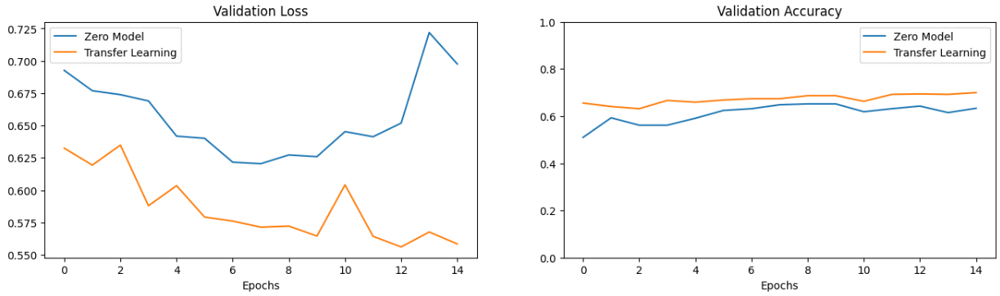

# Bear Classification with Transfer Learning: A Comparative Approach Between Custom Model and VGG16

## **Context and Objective**  
I developed an image classification project to distinguish between **black bears** and **sloth bears**, implementing two strategies:  
1. **Custom CNN model** (built from "scratch").  
2. **Transfer Learning with VGG16** (pre-trained on ImageNet).  

The goal was to compare performance, efficiency, and technical feasibility between traditional approaches and modern Deep Learning methods.

---

## **Methodology and Implementation**

### **Pre-processing and Data Splitting**  
- **Dataset**: 3,620 balanced images (2 classes).  
- **Pipeline**:  
  - Resizing to 224x224 pixels.  
  - Normalization (0-1 scale).  
  - One-hot encoding for labels.  
  - Stratified split (70% train, 15% validation, 15% test).  

```python
# Example of batch dimension expansion during loading
img, x = load_class_images(path)
x = np.expand_dims(x, axis=0)  # Batch dimension addition
```

## **Custom Model Architecture**  
- **Structure**: 4 convolutional layers (32 3x3 filters) with MaxPooling and Dropout.  
- **Regularization**: 25%-50% Dropout to mitigate overfitting.  
- **Dense Layers**: 256 neurons + softmax for binary classification.  

```python
model.add(Conv2D(32, (3,3), activation='relu'))
model.add(MaxPooling2D((2,2)))
model.add(Dropout(0.25))  # Regularization
```

## **Transfer Learning with VGG16**  
- **Weight Freezing**: All VGG16 layers except the final dense layer.  
- **Fine-tuning**: New dense layer (2 neurons) with softmax.  
- **Optimization**: Adam with default learning rate.  

```python
vgg = keras.applications.VGG16(weights='imagenet', include_top=True)
for layer in model_new.layers[:-1]:  # Freeze layers
    layer.trainable = False
```

## **Results and Critical Analysis**

### **Comparative Performance**
| Metric        | Custom Model | VGG16 (Transfer Learning) |
|--------------|-------------|-------------------------|
| Val Accuracy | 63.35%      | 69.98%                  |
| Test Accuracy | 59.12%      | 69.06%                  |
| Val Loss     | 0.6976      | 0.5584                  |


### **Key Insights**

#### **Overfitting in Custom Model:**  
- Training accuracy (76.02%) vs. validation (63.35%) indicates high variance.  
- Suggests need for more data or advanced augmentation techniques.  

#### **Transfer Learning Efficiency:**  
- VGG16 achieved +10% accuracy with fewer epochs (15 vs. 15), validating the power of pre-trained features.  
- More stable learning curve (val_loss: 0.55 vs. 0.69).  

#### **Computational Cost:**  
- VGG16 required ~14s/epoch (GPU) vs. ~1s/epoch for the custom model (CPU), highlighting the precision-resource tradeoff.  

## **Conclusion and Practical Applications**  
This project demonstrated the effectiveness of Transfer Learning in data-limited scenarios — critical for real-world problems where image collection is costly. While computationally intensive, VGG16’s superior generalization makes it ideal for:

- **Species Monitoring**: Automated systems in wildlife reserves.
- **Environmental Education**: Identification apps for eco-tourism.

**Technologies used**: Python, Keras, TensorFlow, Matplotlib, SKLearn.
