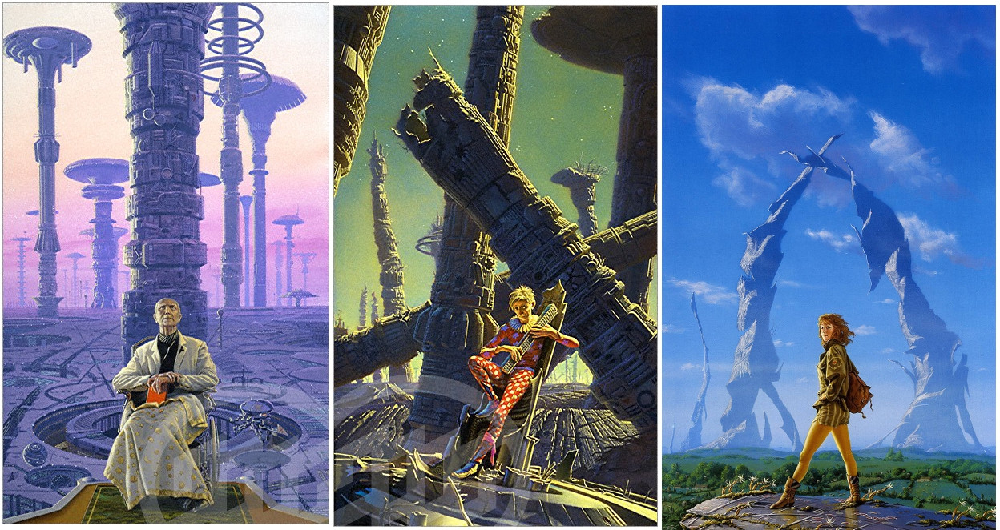
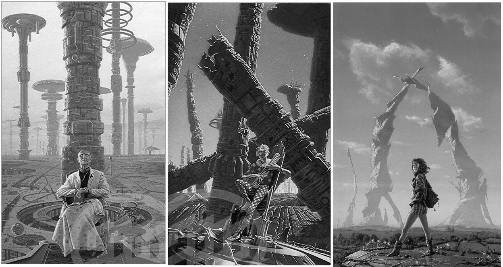
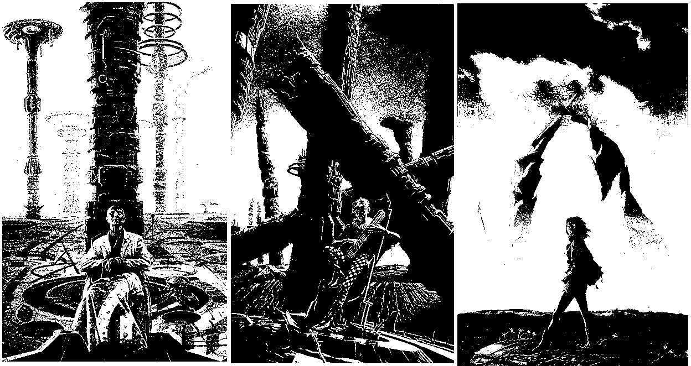

# Conversion of RGB Images to Grayscale and Binary: A Manual Implementation

## **Context and Objective**
This project aimed to manually implement, without advanced libraries, the conversion of a color image (RGB) to **grayscale** and subsequently to **binary**. The motivation was to understand the fundamentals behind these transformations, which are essential in image processing and computer vision.

---

## **Methodology and Implementation**

### **RGB to Grayscale Conversion**
The conversion of an RGB image to grayscale was performed using the standard luminance formula:  

\[
\text{gray} = 0.299 \times R + 0.587 \times G + 0.114 \times B
\]

- **Implementation**:  
  - Iteration over each pixel of the image.  
  - Application of the formula to calculate the grayscale value.  
  - Storage of the result in a new matrix.  

```python
def rgb_to_grayscale(image_rgb):
    height = len(image_rgb)
    width = len(image_rgb[0])
    gray_image = np.zeros((height, width), dtype=np.uint8)
    
    for i in range(height):
        for j in range(width):
            b, g, r = image_rgb[i][j]
            gray = int(0.299 * r + 0.587 * g + 0.114 * b)
            gray_image[i][j] = gray
    
    return gray_image
```

## **Grayscale to Binary Conversion**
The conversion to binary was done by applying a simple threshold:

- Pixels with a value >= 128 are set to white (255).
- Pixels with a value < 128 are set to black (0).

```python
def grayscale_to_binary(gray_image):
    height = len(gray_image)
    width = len(gray_image[0])
    binary_image = np.zeros((height, width), dtype=np.uint8)
    
    for i in range(height):
        for j in range(width):
            binary_image[i][j] = 255 if gray_image[i][j] >= 128 else 0
    
    return binary_image
```

## **Results and Visualization**

### **Generated Images**
- **Original**: Color image in RGB format.
- **Grayscale**: Image converted to grayscale.
- **Binary**: Binarized image with a threshold of 128.

### **Visualization with Matplotlib**
The images were displayed side by side for comparison:

```python
plt.figure(figsize=(30, 15))

# Original
plt.subplot(1, 3, 1)
plt.imshow(image_rgb)
plt.title("Original Image")
plt.axis('off')

# Grayscale
plt.subplot(1, 3, 2)
plt.imshow(gray_image, cmap='gray')
plt.title("Gray Image")
plt.axis('off')

# Binary
plt.subplot(1, 3, 3)
plt.imshow(binary_image, cmap='gray')
plt.title("Binary Image")
plt.axis('off')

plt.show()

```

<p align="center">
    
    
    
</p>

## **Conclusion and Practical Applications**
This project demonstrated the effectiveness of basic image processing techniques, such as grayscale conversion and binarization, which are fundamental in applications like:

- **Pattern Recognition**: Preprocessing for edge or object detection.
- **OCR (Optical Character Recognition)**: Contrast enhancement for text reading.
- **Image Segmentation**: Isolation of regions of interest.

The manual implementation, although less efficient than optimized methods from libraries like OpenCV, provided a deep understanding of the algorithms involved. For next steps, it would be interesting to explore adaptive thresholding and noise filtering techniques to improve binarization quality.

**Technologies used**: Python, NumPy, Matplotlib.