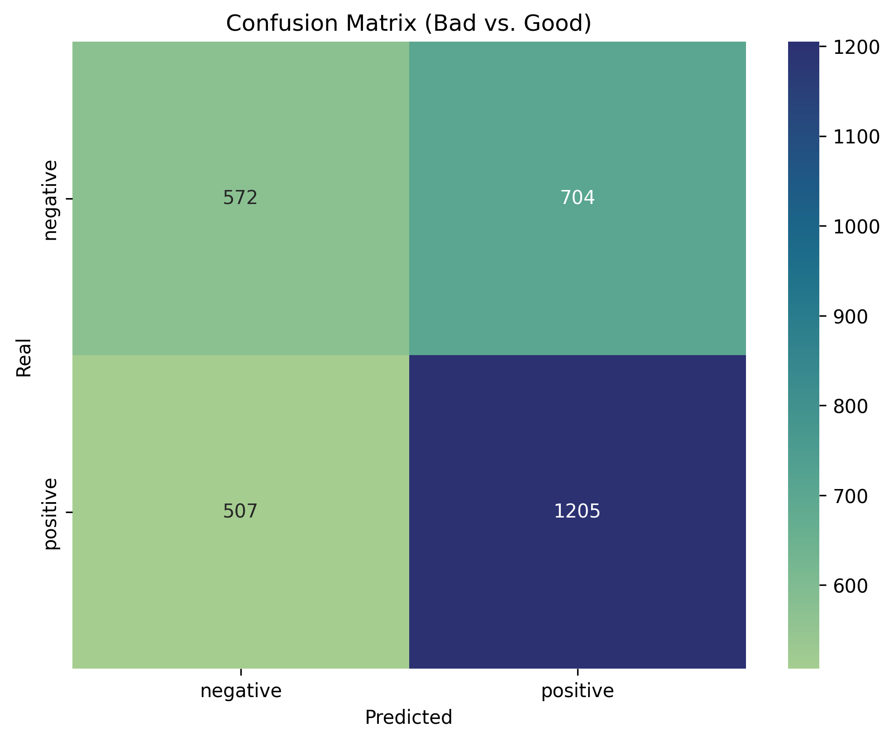

# Wine Quality Classification with Neural Networks: A Binary Approach

## **Context and Objective**
This project aimed to classify wine quality into two categories (**low quality** [3-5] vs. **high quality** [6-9]) using physicochemical properties. A neural network was implemented to demonstrate the application of deep learning in quality prediction for the wine industry.

---

## **Methodology and Implementation**

### **Dataset Preparation**
- **Source**: Balanced Kaggle dataset (21,000 entries, 12 features).  
- **Key Features**: Fixed acidity, volatile acidity, alcohol content, sulphates, etc.  
- **Preprocessing**:  
  - Removed 6,060 duplicates.  
  - StandardScaler for feature normalization.  
  - Binary target encoding: `0` (low quality), `1` (high quality).  

```python
# Binary class conversion
y = np.where((y >= 3) & (y <= 5), 0, 1)
```

### **Model Architecture**
- **Structure**: 3-layer neural network (64-32-1 neurons).  
- **Activation**: ReLU for hidden layers, Sigmoid for output.  
- **Optimization**: Adam optimizer with binary cross-entropy loss.  

```python
model = Sequential([
    Input(shape=(11,)),
    Dense(64, activation='relu'),
    Dense(32, activation='relu'),
    Dense(1, activation='sigmoid')
])
```

### **Training**
- **Parameters**: 100 epochs, batch_size=32, 15% validation split.  
- **Performance**:  
  - Final Validation Accuracy: **59.73%**  
  - Final Validation Loss: **0.7120**  


---

## **Results and Analysis**

### **Confusion Matrix**
|                  | Predicted Low | Predicted High |
|------------------|---------------|----------------|
| **Actual Low**   | 625 (TN)      | 651 (FP)       |
| **Actual High**  | 552 (FN)      | 1160 (TP)      |


### **Key Metrics**
| Metric          | Value  |
|-----------------|--------|
| Accuracy        | 0.642  |
| Precision       | 0.640  |
| Recall          | 0.678  |
| Specificity     | 0.490  |
| F1-Score        | 0.658  |


---

## **Conclusion and Practical Implications**

### **Insights**
1. **Moderate Performance**: The model achieved **64.2% accuracy**, indicating moderate predictive capability.  
2. **Class Imbalance Impact**: Higher recall (67.8%) vs specificity (49%) suggests better identification of high-quality wines.  
3. **Overfitting Signs**: Validation loss plateaued early while training loss continued decreasing.  

### **Industry Applications**
- **Quality Control**: Preliminary screening in wineries.  
- **Blending Optimization**: Predict quality impacts of ingredient ratios.  
- **Supply Chain**: Automated quality grading for distribution.  

### **Future Improvements**
- **Feature Engineering**: Experiment with interaction terms (e.g., alcohol-sulphates ratio).  
- **Class Balancing**: Apply SMOTE for minority class augmentation.  
- **Architecture Tuning**: Add dropout layers (25-30%) to reduce overfitting.  

*Technologies used: Python, TensorFlow/Keras, Scikit-learn, Pandas, Matplotlib/Seaborn.*
